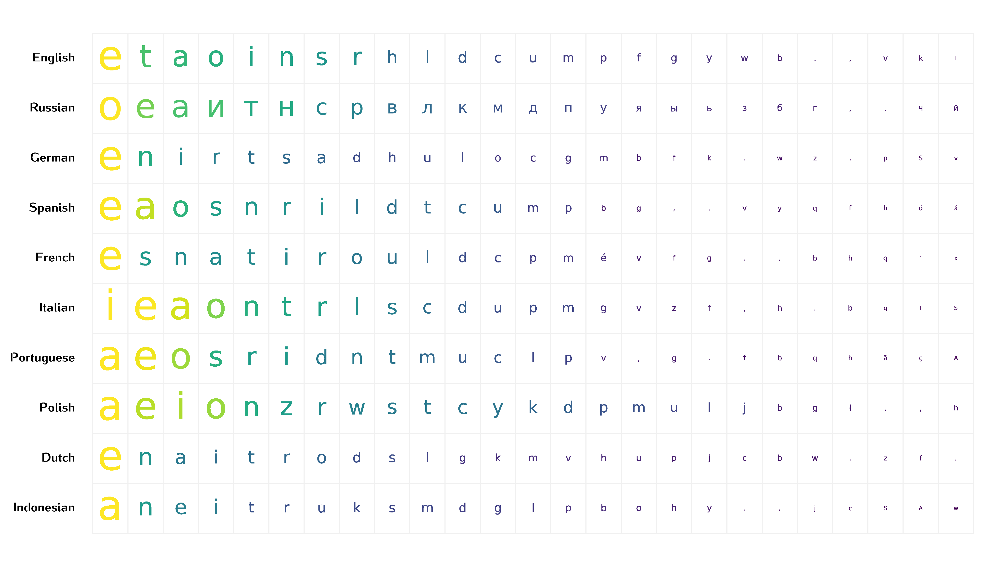
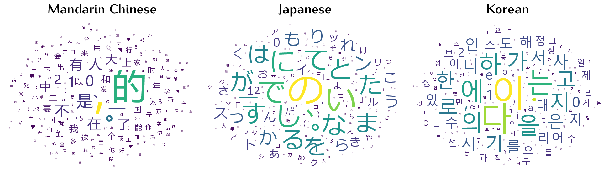

# FineFreq

**FineFreq: A Multilingual Character Frequency Dataset from Web-Scale Text**

**FineFreq** provides large-scale, per-language character frequency tables derived from 96.6 trillion characters across 1900+ languages, covering Common Crawl-based corpora from 2013 to 2025 (FineWeb v1.4 and FineWeb2 v2.1.0). It includes aggregate and year-resolved frequency data, enabling diachronic and cross-linguistic analysis.

[](https://arxiv.org/abs/2512.09701)
[](https://huggingface.co/datasets/lgi2p/finefreq)


- Languages 1900+
- Total characters 96.6 trillion
- Time span 2013-2025
- Data sources FineWeb (English), FineWeb2 (Multilingual)

Each character entry includes: Unicode codepoint and name; Script and general category; Total and per-year frequencies

## Repository Structure

```
├───csv/                  # Character frequency tables (per-language, CSV)
├───parquet/              # Same as above, in Parquet
├───metadata/             # Stats JSONs
├───manifest/             # languages.csv / languages.parquet (index of available languages)
├───figures
├── README.md
```



## Manifest File

See `manifest/languages.csv` for a full list of available languages, with fields:

- ISO 639-3 code
- Script
- Language name
- Character count
- Total frequency
- Available years
- Data source

## Citation
```
@article{Xu2025finefreq,
  title={FineFreq: A Multilingual Character Frequency Dataset from Web-Scale Text},
  author={Binbin Xu},
  journal={arXiv preprint arXiv:2512.09701},
  year={2025}, 
  url = {https://arxiv.org/abs/2512.09701}
}
```
